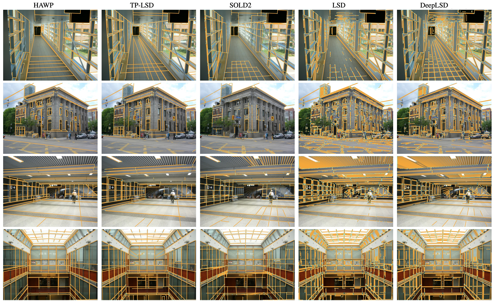

<p align="center">
  <h1 align="center"><br><ins>Line Segment Detection</ins><br>A collection of line segment detection algorithms</h1>
 
</p>

## 

This repository hosts the papers with code for line segment detection, enjoy yourself. 
(线段检测算法汇总，请各位自行调试)

<!--  -->


<!--  -->

## Usage

``` bash
git clone --recurse-submodules https://github.com/Vincentqyw/LineSegmentsDetection.git
```

## DeepLSD

- Title: "DeepLSD: Line Segment Detection and Refinement with Deep Image Gradients", Arxiv 2022.
- Paper: https://arxiv.org/abs/2212.07766
- Code: https://github.com/cvg/DeepLSD

## M-LSD

- Title: "M-LSD: Towards Light-weight and Real-time Line Segment Detection", AAAI 2022.
- Paper: [https://arxiv.org/abs/2106.00186](https://arxiv.org/abs/2106.00186)
- Code: https://github.com/navervision/mlsd

## F-Clip

- Title: "Fully Convolutional Line Parsing", Neurocomputing 2022.
- Paper: [https://arxiv.org/abs/2104.11207](https://arxiv.org/abs/2104.11207)
- Code: https://github.com/Delay-Xili/F-Clip

## SOLD2

- Title: "SOLD2: Self-supervised Occlusion-aware Line Description and Detection", CVPR 2021.
- Paper: https://arxiv.org/abs/2104.03362
- Code: https://github.com/cvg/SOLD2, [[Kornia Tutorial]](https://kornia-tutorials.readthedocs.io/en/latest/line_detection_and_matching_sold2.html)

## LETR

- Title: "Line Segment Detection Using Transformers without Edges", CVPR 2021.
- Paper: [https://arxiv.org/abs/2101.01909](https://arxiv.org/abs/2101.01909)
- Code: https://github.com/mlpc-ucsd/LETR

## HAWP

- Title: "Holistically-Attracted Wireframe Parsing: From Supervised Learning to Self-Supervised Learning", CVPR 2020.
- Paper: https://arxiv.org/abs/2210.12971
- Code: https://github.com/cherubicXN/hawp

## TP-LSD

- Title: "TP-LSD: Tri-Points Based Line Segment Detector", ECCV 2020.
- Paper: https://arxiv.org/abs/2009.05505
- Code: https://github.com/Siyuada7/TP-LSD

## ULSD

- Title: "ULSD: Unified Line Segment Detection across Pinhole, Fisheye, and Spherical Cameras", ISPRS 2020.
- Paper: https://arxiv.org/abs/2011.03174
- Code: https://github.com/lh9171338/Unified-Line-Segment-Detection

## Deep-Hough-Transform-Line-Priors

- Title: "Deep Hough-Transform Line Priors", ECCV 2020.
- Paper: [https://arxiv.org/abs/2007.09493](https://arxiv.org/abs/2007.09493)
- Code: https://github.com/yanconglin/Deep-Hough-Transform-Line-Priors

## AFM-LSD

- Title: "Learning Attraction Field Representation for Robust Line Segment Detection", CVPR 2019.
- Paper: [https://arxiv.org/abs/1812.02122](https://arxiv.org/abs/1812.02122)
- Code: https://github.com/cherubicXN/afm_cvpr2019

## L-CNN

- Title: "End-to-End Wireframe Parsing", ICCV 2019.
- Paper: [https://arxiv.org/abs/1905.03246](https://arxiv.org/abs/1905.03246)
- Code: https://github.com/zhou13/lcnn

## MCMLSD

- Title: "MCMLSD: A Dynamic Programming Approach to Line Segment Detection", CVPR 2017.
- Paper: http://openaccess.thecvf.com/content_cvpr_2017/papers/Almazan_MCMLSD_A_Dynamic_CVPR_2017_paper.pdf
- Code: http://www.elderlab.yorku.ca/?smd_process_download=1&download_id=8423

## CannyLines

- Title: "CannyLines: A Parameter-Free Line Segment Detector", ICIP 2015.
- Project Page: https://cvrs.whu.edu.cn/cannylines
- Paper: http://cvrs.whu.edu.cn/projects/cannyLines/papers/CannyLines-ICIP2015.pdf
- Code: http://cvrs.whu.edu.cn/projects/cannyLines/codes/CannyLines-v3.rar

## EDline

- Title: "Edge Drawing: A Combined Real-Time Edge and Segment Detector", JVCIR 2012.
- Paper: https://www.sciencedirect.com/science/article/abs/pii/S1047320312000831
- Code: https://github.com/mtamburrano/LBD_Descriptor

## LSD

- Title: "LSD: a Line Segment Detector", Image Processing On Line 2012
- Project Page: http://www.ipol.im/pub/art/2012/gjmr-lsd/
- Paper: http://www.ipol.im/pub/art/2012/gjmr-lsd/article.pdf
- Code: http://www.ipol.im/pub/art/2012/gjmr-lsd/lsd_1.5.zip

## LSWMS

- Title: "Line segment detection using weighted mean shift procedures on a 2D slice sampling strategy", Pattern Analysis and Applications 2011.
- Paper: [https://www.researchgate.net/LSWMS.pdf](https://www.researchgate.net/profile/Marcos_Nieto3/publication/220654859_Line_segment_detection_using_weighted_mean_shift_procedures_on_a_2D_slice_sampling_strategy/links/56a5d56a08aef91c8c16b1ac.pdf?inViewer=0&origin=publication_detail&pdfJsDownload=0)
- Code: https://sourceforge.net/projects/lswms/